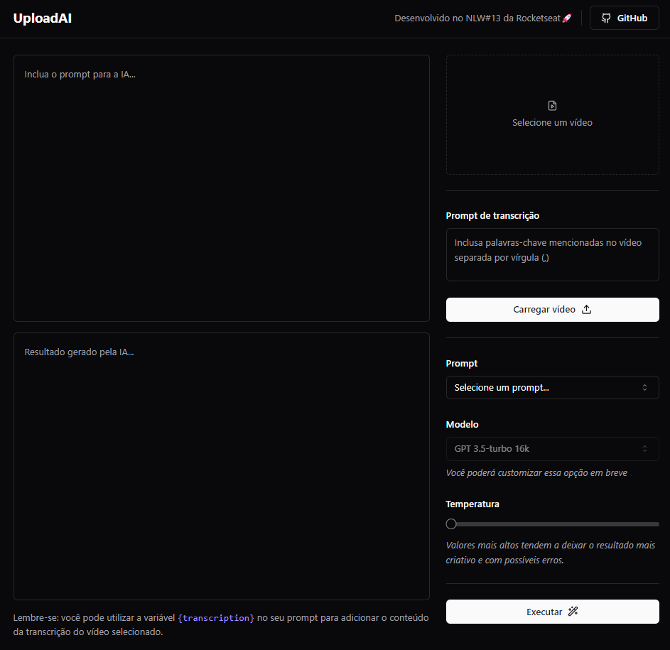

<h1 align="center">
  UploadAI
</h1>

<p align="center">
    <a href="#-descrição">Descrição</a>&nbsp;&nbsp;&nbsp;|&nbsp;&nbsp;&nbsp;
    <a href="#-iniciar-projeto">Iniciar Projeto</a>&nbsp;&nbsp;&nbsp;|&nbsp;&nbsp;&nbsp;
    <a href="#-iniciar-api">API</a>&nbsp;&nbsp;&nbsp;|&nbsp;&nbsp;&nbsp;
    <a href="#-iniciar-aplicação-react">React</a>&nbsp;&nbsp;&nbsp;|&nbsp;&nbsp;&nbsp;
    <a href="#-contate-me">Contate-me</a>
</p>

<br>

<p align="center">
    
</p>

## 📚 Descrição

UploadAI é um Playground de Inteligência Artificial da OpenAI em React. Ele permite a conversão de vídeos em áudio e transcrição, facilitando a criação de prompts personalizados para interagir com a IA da OpenAI. Os prompts podem gerar títulos e respostas com base no conteúdo do vídeo. É uma ferramenta educativa e experimental para explorar as capacidades da IA da OpenAI.

## 👷 Iniciar projeto

```bash
#Copie o repositório
$ git clone https://github.com/Ronald785/uploadAI-nlw13
```

## 📦 Iniciar API

```bash
#Acesse o projeto
$ cd uploadAI-nlw13\server

#Instale as dependências
$ npm install

#Aplica migrações ao BD
$ npx prisma db push

#Preenche o BD com o arquivo seed
$ npx prisma db seed

#Modifique o arquivo .env com sua API Key da OpenAI

#Inicie a API
$ npm run dev
```

## 💻 Iniciar aplicação React

```bash
#Acesse o projeto
$ cd uploadAI-nlw13\web

#Instale as dependências
$ npm install

#Inicie a aplicação
$ npm run dev
```

## 📬 Contate-me

<p align="left">
    <a href="https://www.linkedin.com/in/ronald785/">
        
    </a>
    &nbsp;
    <a href="mailto:ronaldmateus785@gmail.com">
        
    </a>
</p>

## 📝 Licença

Lançado em 2023 📝 [Licença MIT](./LICENSE)

---

NLW AI - [Rocketseat](https://www.rocketseat.com.br/)🚀
